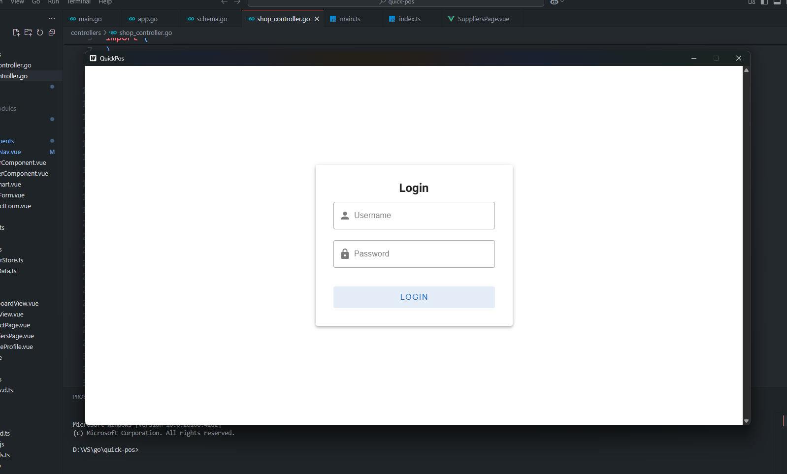
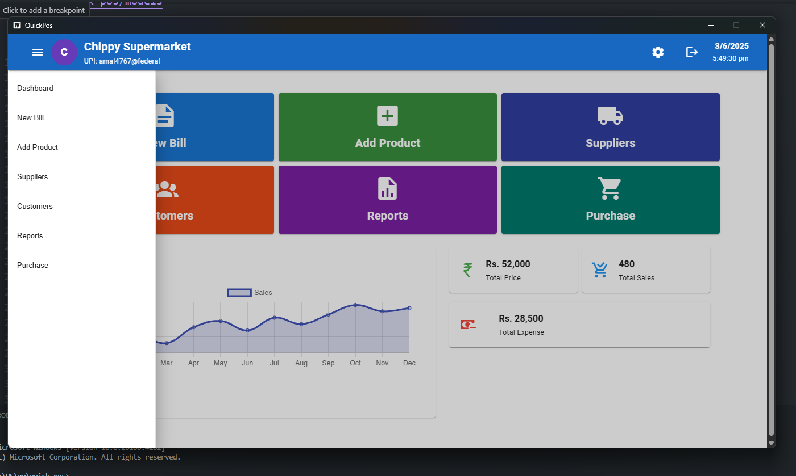
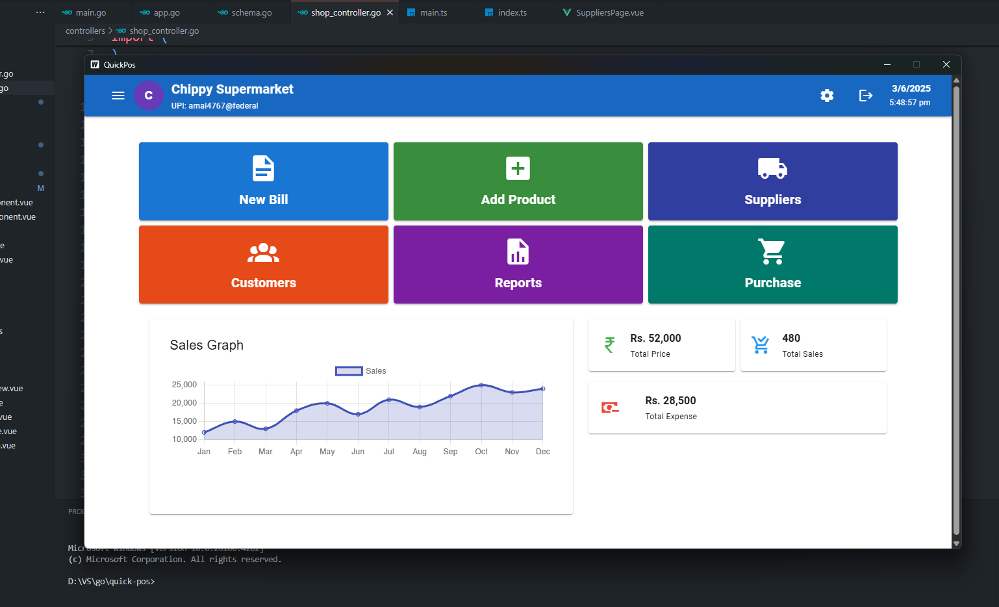

# 💼 Quick-POS

Quick-POS is a fast and modern desktop Point-of-Sale (POS) application built using [Wails](https://wails.io), leveraging the power of Go for backend logic and Vue 3 with Vuetify for a rich, responsive frontend. This application is designed for small to medium-sized businesses to manage their sales operations efficiently.

---

## 🚀 Tech Stack

- ⚙️ **Golang** - Backend logic and business rules
- 🖼️ **Vue 3** - Modern reactive frontend
- 🎨 **Vuetify** - Material design component framework
- 🧠 **TypeScript** - Type-safe frontend development
- 💾 **SQLite** - Lightweight embedded database
- 🖥️ **Wails** - For building cross-platform desktop apps with Go + frontend

---

## ✨ Features

- 🔐 **Authentication System** - Secure login for authorized users
- 🏪 **Store Profile Management** - Easily manage store information and settings
- 📊 **Informative Dashboard** - Visual representation of key metrics like sales, revenue, etc.
- 📁 **Local SQLite Storage** - Lightweight and easy-to-manage database
- ⚡ **Fast UI with Vite** - Instant reload and smooth dev experience

---

## 📷 Screenshots

### 🔑 Login Page


### 📚 Sidebar Navigation


### 📊 Dashboard Overview


---

## 🧪 Live Development

To start the development server:

```bash
wails dev
